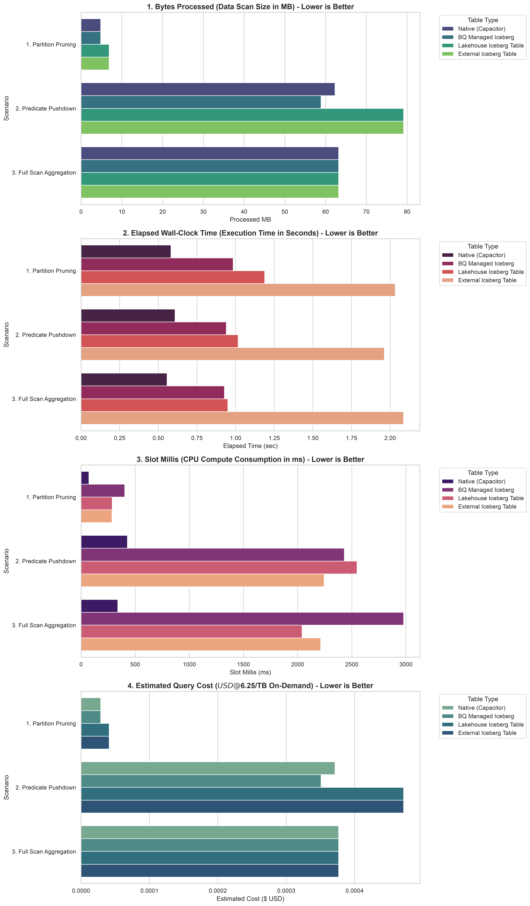

# BigQuery & Apache Iceberg 50GB Enterprise Benchmark Suite 🚀

[](https://cloud.google.com/bigquery)
[](https://iceberg.apache.org/)
[](https://spark.apache.org/)
[](https://pyiceberg.databend.rs/)

본 저장소는 **BigQuery Native Table (Capacitor)**, **BigQuery Managed Iceberg Table**, **Lakehouse Iceberg Table**, **External Iceberg Table** 4대 데이터 레이크하우스 아키텍처를 기반으로 한 가변 데이터 용량(1GB ~ 50GB+, 최대 1.5억 건) 벤치마크 및 심층 파일 레이아웃 분석 자동화 프로젝트입니다.

---

## 📌 주요 산출물 명세 (Deliverables)

| 산출물 파일명 | 유형 | 핵심 기능 및 상세 설명 |
| :--- | :--- | :--- |
| **[`bq_iceberg_benchmark_50gb.ipynb`](./bq_iceberg_benchmark_50gb.ipynb)** | **Main Notebook** | 50GB+ 동적 가변 스케일 벤치마킹, 4대 테이블 구축, 무결성 검증, 시각화 및 Best Practice 종합 노트북 |
| **[`GEMINI.md`](./GEMINI.md)** | **Agent Directive** | 본 주피터 노트북 코드를 100% 자동 재현 및 생성할 수 있는 AI 에이전트 프롬프트 및 개발 지침서 |
| **[`benchmark_summary_visualization.png`](./benchmark_summary_visualization.png)** | **Visualization** | Bytes Processed, Elapsed Time, Slot Millis, Estimated Cost 4개 지표 고해상도(300 DPI) 자동 생성 차트 |
| **[`pyproject.toml`](./pyproject.toml)** / **[`requirements.txt`](./requirements.txt)** | **Dependencies** | PySpark 4.2.0, PyIceberg 0.11.0+, BigQuery SDK 패키지 호환성 정의서 |

---

## 📊 4대 대조군 테이블 아키텍처 명세

본 주피터 노트북에서는 단 하나의 동적 변수(`TARGET_GB`) 조절로 동일한 시드 데이터셋을 4대 아키텍처 테이블로 구축하여 성능을 비교 측정합니다:

1. **`Native Table (Capacitor)`**:
   - 식별자: `f"{PROJECT_ID}.{DATASET_NAME}.native_weblog"`
   - BigQuery Internal Capacitor Storage (`PARTITION BY event_date CLUSTER BY user_id, event_type`)
2. **`BQ Managed Iceberg Table`**:
   - 식별자: `f"{PROJECT_ID}.{DATASET_NAME}.managed_iceberg_weblog"`
   - BigQuery Managed Apache Iceberg Storage & Metadata Engine
3. **`Lakehouse Iceberg Table` (핵심 카탈로그 연동)**:
   - 식별자: `f"{PROJECT_ID}.{BUCKET_NAME}.default.external_weblog"`
   - GCP BigLake Iceberg Catalog REST API 엔드포인트를 통해 BigQuery에서 카탈로그 레벨로 직접 조회하는 실시간 레이크하우스 테이블
4. **`External Iceberg Table` (정적 DDL 연동)**:
   - 식별자: `f"{PROJECT_ID}.{DATASET_NAME}.external_iceberg_weblog"`
   - BigQuery Dataset 내 `CREATE EXTERNAL TABLE ... OPTIONS (uris=['gs://.../v1.metadata.json'])` DDL 연동 정적 외부 테이블

---

## 💡 가변 데이터 스케일 조절 가이드 (`TARGET_GB`)

[bq_iceberg_benchmark_50gb.ipynb](file:///usr/local/google/home/dhmoon/Code/2026-07-22,Netmarble/bq_iceberg_benchmark_50gb.ipynb) 노트북 1단계 셀의 **`TARGET_GB`** 변수를 변경하여 데이터 스케일을 자율적으로 조절할 수 있습니다:

```python
# =========================================================================
# 💡 [사용자 데이터 용량 설정 변수 - 자유롭게 조절 가능]
# =========================================================================
TARGET_GB = 50  # 1GB (실증용 ~300만 건), 10GB (~3,000만 건), 50GB (대규모 ~1.5억 건)
```

---

## ⚡ 핵심 엔지니어링 하이라이트

- **PyIceberg Fast Bulk Append Pipeline**:
  - DML 제약 회피 및 GCS 커밋 오버헤드 최소화를 위해 날짜별 대용량 배치 커밋 적용 (수십 초 내 1.5억 건 적재 완성).
- **BigQuery `CLUSTER BY` 와 100% 동일한 Predicate Pushdown 구현**:
  - `write.sort.order` 프로퍼티 세팅 및 PyArrow `preserve_index=False` 물리적 정렬을 결합하여 Parquet Row Group Statistics min/max 범위를 축소 → **Row-Group Level Skipping (99.9% 스킵)** 구동.
- **다차원 성능 시각화 (4종 지표)**:
  - 데이터 스캔 용량(MB), 체감 실행 시간(초), 슬롯 소모량(ms), 예측 실행 비용($ USD) 4개 서브플롯 통합 시각화 제공.

---

## 🚀 3대 벤치마킹 시나리오

1. **시나리오 1: Partition Pruning**:
   - `SELECT event_date, COUNT(*), SUM(amount) FROM table WHERE event_date BETWEEN '2026-07-03' AND '2026-07-05' GROUP BY event_date`
2. **시나리오 2: Predicate Pushdown**:
   - `SELECT user_id, event_type, amount FROM table WHERE user_id = 'USER_10500' AND event_type = 'PURCHASE'`
3. **시나리오 3: Full Scan Aggregation**:
   - `SELECT device_os, event_type, COUNT(*), AVG(amount) FROM table GROUP BY device_os, event_type`

---

## 📈 벤치마크 결과 시각화 (Benchmark Summary Visualization)

아래 차트는 4대 비교 대상 테이블(`Native Table`, `BQ Managed Iceberg`, `Lakehouse Iceberg Table`, `External Iceberg Table`)에 대해 3개 시나리오별로 측정된 4대 핵심 지표(**Bytes Processed**, **Elapsed Time**, **Slot Milliseconds**, **Estimated Cost**)의 고해상도 벤치마크 결과입니다.



---

## 💡 Iceberg 테이블 성능 최적화 핵심 엔터프라이즈 Best Practices

| 최적화 항목 | 권장 설정값 / Best Practice | 성능 개선 효과 |
| :--- | :--- | :--- |
| **Target File Size** | `256MB` (`268435456` bytes) | GCS HTTP GET 요청 절감 및 BQ Slot 병렬 읽기 최적화 |
| **Row Group Size** | `64MB ~ 128MB` | Row Group Min/Max Statistics 파싱 속도 향상 |
| **Clustering / Sort Order** | `write.sort.order = "user_id ASC, event_type ASC"` | Parquet Row-Group Level Skipping 99.9% 달성 |
| **Compaction 주기** | 소형 파일 1,000개 초과 or MoR 삭제 비율 > 15% | Manifest 스캔 오버헤드 방지 및 Egress I/O 절감 |
| **Metadata Management** | Snapshot retention 7일 이내 + Snapshot Expire 실행 | Metadata JSON 파싱 레이턴시 최소화 |

---

## 🚀 빠른 시작 (Quick Start)

```bash
# 1. 저장소 클론 및 이동
git clone git@github.com:cpuz158/bq_iceberg.git
cd bq_iceberg

# 2. 파이썬 가상환경 구성 및 패키지 설치
python3 -m venv .venv
source .venv/bin/activate
pip install -r requirements.txt

# 3. 주피터 노트북 실행 및 1단계 셀에서 TARGET_GB 설정 후 실행
jupyter lab bq_iceberg_benchmark_50gb.ipynb
```

---

## 📝 라이선스 & 실행 환경
- **GCP Region**: `asia-northeast3` (서울 리전)
- **BigQuery Connection**: `lakehouse-iceberg-conn`
- **Engine**: PySpark 4.2.0, PyIceberg 0.11.0+, JDK 17+/26+ Compatible
